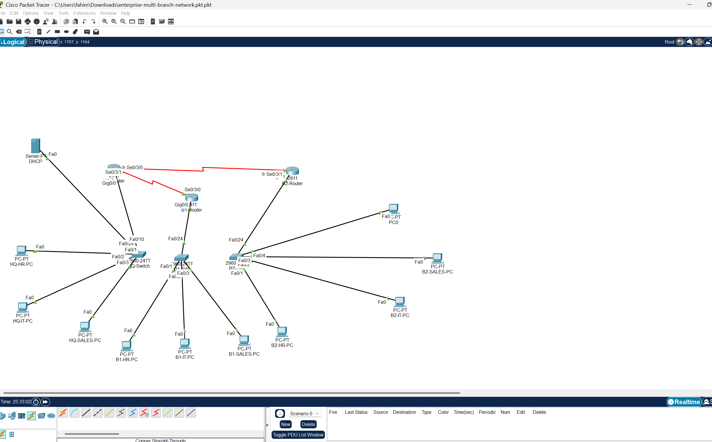

# Enterprise Multi-Branch Network (Cisco Packet Tracer)

This project demonstrates the design and implementation of a multi-branch enterprise network using Cisco Packet Tracer.

## Features

• VLAN segmentation (HR, IT, Sales)  
• Router-on-a-Stick for inter-VLAN routing  
• EIGRP dynamic routing between routers  
• Access Control Lists (ACL) for security policies  
• DHCP configuration for automatic IP assignment  
• Multi-branch network communication

## Network Topology

## Technologies Used

- Cisco Packet Tracer
- VLANs
- Router-on-a-Stick
- EIGRP
- ACL (Access Control Lists)
- DHCP

## Project Files

- `enterprise-multi-branch-network.pkt` → Packet Tracer network file
- `configs/` → Router configuration files
- `topology.png` → Network topology diagram

## Author

Fahimuzzaman Fahim  
Computer Information Technology  
Minnesota State University, Mankato
